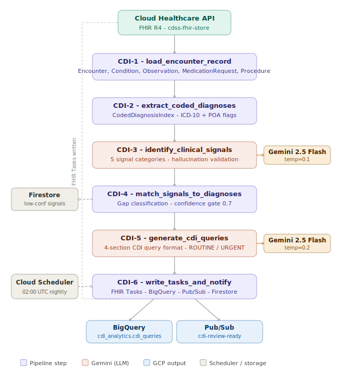

# HC-6 — Clinical Documentation Integrity (CDI) Agent

> **Healthcare Agentic AI Portfolio · Project 6 of 9**

A production-grade agentic pipeline built on **Google ADK + Gemini** that analyzes inpatient hospital encounters for clinical documentation gaps, undocumented diagnoses, and present-on-admission (POA) classification issues. The agent generates structured CDI physician queries and writes them as **FHIR R4 Task resources** for clinical review.

---

## What It Does

Clinical Documentation Integrity (CDI) is the discipline of ensuring the medical record accurately reflects the patient's clinical picture. Poor documentation directly affects:

- **DRG assignment** — wrong DRG = wrong reimbursement
- **Severity of illness scoring** — affects quality metrics and risk adjustment
- **POA classification** — affects hospital-acquired condition penalties
- **ICD-10 coding accuracy** — affects every downstream analytics and billing workflow

This agent automates the signal detection and query generation work that CDI specialists perform manually for every inpatient encounter.

---

## Architecture



---

## The Five Signal Categories

| Category | Examples |
|----------|---------|
| **Lab Abnormalities** | Creatinine rising trend → AKI (N17.9), Albumin < 3.0 → Malnutrition (E44), WBC > 12k → SIRS |
| **Medication Orders** | Insulin drip → DKA/hyperglycemic crisis (E11.10), Vasopressors → Septic Shock (A41.9) |
| **Observation Patterns** | SpO2 < 92% → Hypoxic Respiratory Failure (J96.00), Persistent hypotension → Shock |
| **Procedure Inconsistency** | Mechanical ventilation without Respiratory Failure coded, Hemodialysis without AKI/CKD |
| **POA Ambiguity** | Conditions coded POA=U where admission labs support determination |

---

## GCP Stack

| Service | Purpose |
|---------|---------|
| Cloud Healthcare API (FHIR R4) | Patient encounter data source and Task write target |
| Vertex AI / Gemini 2.5 Flash | CDI-3 signal identification, CDI-5 query generation |
| BigQuery (`cdi_analytics.cdi_queries`) | Full audit log of every CDI query generated |
| Pub/Sub (`cdi-review-ready`) | Outbound notification when Tasks are written |
| Firestore (`cdi_query_history`) | Low-confidence signals for internal CDI specialist review |
| Cloud Scheduler | Nightly sweep of all active inpatient encounters at 02:00 UTC |
| Google ADK | Agent orchestration and Web UI trace view |

---

## Project Structure

```
adk-cdi-agent/
├── agent.py                        # Cloud Run entry point
├── agents/cdi/
│   ├── agent.py                    # Pipeline orchestrator + ADK root_agent
│   ├── prompts.py                  # CDI-3 and CDI-5 prompt templates
│   └── tools/
│       ├── load_encounter.py       # CDI-1: FHIR data load
│       ├── extract_diagnoses.py    # CDI-2: Coded diagnosis index
│       ├── identify_signals.py     # CDI-3: Gemini signal detection
│       ├── match_gaps.py           # CDI-4: Gap classification
│       ├── generate_queries.py     # CDI-5: CDI query generation
│       └── write_tasks.py          # CDI-6: FHIR Tasks + BigQuery + Pub/Sub
├── shared/
│   ├── config.py                   # Environment config
│   ├── models.py                   # Pydantic data models
│   ├── fhir_client.py              # Cloud Healthcare API client
│   └── bigquery_client.py          # BigQuery streaming insert client
├── scripts/
│   ├── load_test_encounter.py      # Load James Thornton synthetic FHIR data
│   ├── test_unit.py                # Unit tests
│   └── test_integration.py        # Integration tests (live GCP)
└── data/signal_taxonomy/           # Signal category reference JSON
```

---

## Pydantic Models

```python
ClinicalSignal      # CDI-3 output: signal type, ICD-10, confidence, source resource IDs
CodedDiagnosisIndex # CDI-2 output: all coded diagnoses with POA flags
DiagnosisGap        # CDI-4 output: gap type, query_warranted flag
GapAnalysis         # CDI-4 output: full gap analysis with threshold counts
CDIQuery            # CDI-5 output: 4-section physician query
CDIPipelineResult   # CDI-6 output: pipeline summary
```

---

## Confidence Gate

Signals with confidence `>= 0.7` generate physician-facing FHIR Task resources.
Signals with confidence `< 0.7` are written to Firestore (`cdi_query_history`) for internal CDI specialist review only. This prevents noise and builds CDI specialist trust in the system.

---

## Medical Disclaimer

This project is a portfolio demonstration built for educational and research purposes only. It is not a certified medical device, clinical decision support system, or approved healthcare software product.

The CDI Agent and all outputs it generates, including physician queries, ICD-10 code suggestions, and clinical signal identifications, are not intended to constitute medical advice, clinical diagnosis, or coding guidance for use in actual patient care or billing.

All clinical logic, thresholds, and ICD-10 mappings are approximations based on publicly available CDI guidelines and are not validated against any clinical standard or regulatory framework. Do not use this software to make or influence real patient care decisions, reimbursement decisions, or compliance determinations.

The synthetic patient data included in this repository (James Thornton) is entirely fictitious. Any resemblance to real persons is coincidental.

---

## Test Patient: James Thornton

Synthetic inpatient with designed CDI signal coverage:

| Signal | Finding | Implied Dx | ICD-10 | Confidence |
|--------|---------|-----------|--------|-----------|
| Lab | Creatinine 1.1→1.4→1.8 mg/dL (rising trend) | Acute Kidney Injury | N17.9 | 0.90 |
| Medication | Insulin drip ordered | DKA / Hyperglycemic Crisis | E11.10 | 0.90 |
| Lab | Albumin 2.7 g/dL | Malnutrition | E44.0 | 0.90 |
| Lab | WBC 14,200 /uL | SIRS / Infection | A41.9 | 0.75 |
| POA | CKD coded POA=U | POA clarification needed | N18.3 | 0.90 |
| Specificity | HbA1c 8.4% + E11.9 coded | DM specificity improvement | E11.65 | 0.80 |

---

## Related Projects

| Project | Repo | Description |
|---------|------|-------------|
| HC-1 CDSS | [adk-cdss-agent](https://github.com/gbhorne/adk-cdss-agent) | Clinical Decision Support System |
| HC-2 Prior Auth | [adk-prior-auth-agent](https://github.com/gbhorne/adk-prior-auth-agent) | Prior Authorization Agent |

---

## Portfolio

Part of a 21-project Healthcare + Security + Retail + Financial AI portfolio built on Google ADK and LangGraph. See the full roadmap at [gbhorne](https://github.com/gbhorne).

---

*Built by Gregory Horne — GCP Cloud Architect & AI/ML Engineer*
